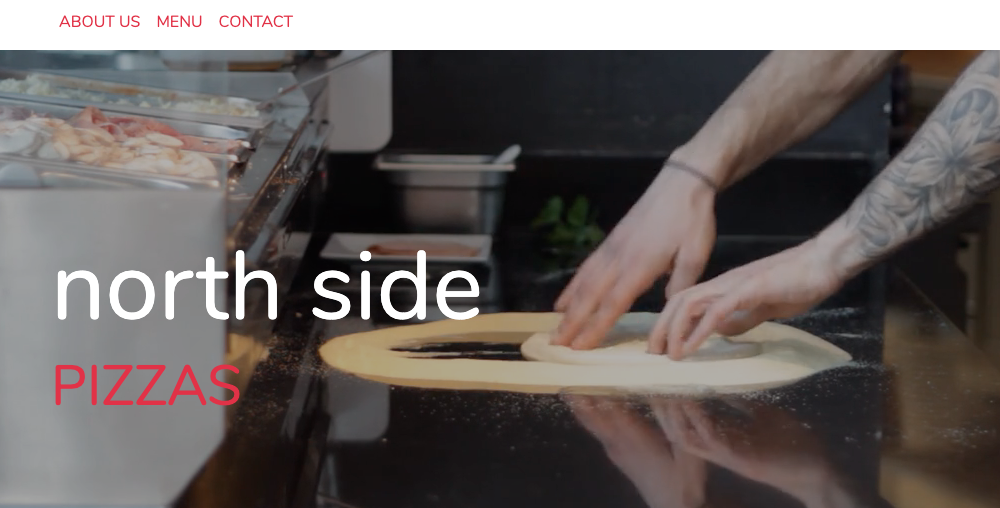

# north side pizzas
#### This is a website for a fictional pizza place.
#### July 2019
#### By **Peter Kingori Ndegwa**

## Description
This is a website for a fictional pizza place. A user should be able to read information about the restaurant, see the menu, make an order online, enter their location and see a summary of their order including the total cost. The link to the live site is https://peterkingori.github.io/NorthSide/
## Setup/Installation Requirements
All the code used is available for viewing on this repository. You can clone or download all the documents to you computer then run the html file in your browser. Alternatively, you can fork this repository. 
## Known Bugs
No know bugs at the time of uploading the files.
## Technologies Used
I used HTML, CSS, Javascript and jQuery.
## Support and contact details
If you run into any issues or would like to make a contribution to the work kindly email me at kpndegwa@gmail.com
### License
This project is free to use under the **GNU General Public License**. See the full [LICENSE](https://choosealicense.com/licenses/gpl-3.0/) for details.
Copyright (c) 2019 **Peter Kingori Ndegwa**